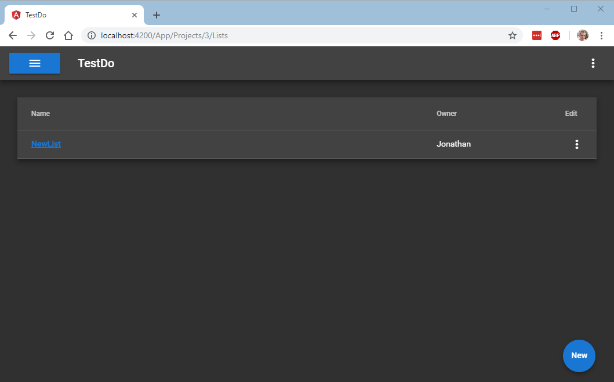
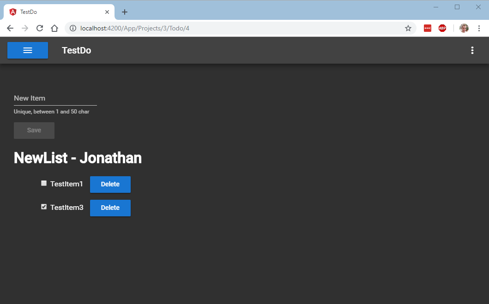

# TestDo

This project is a simple ToDo list application used to demonstrate key concepts and examples of how to unit test an Angular application. The application allows users to create projects consisting of multiple ToDo lists.

This project was generated with [Angular CLI](https://github.com/angular/angular-cli). To get more help on the Angular CLI use `ng help` or go check out the [Angular CLI README](https://github.com/angular/angular-cli/blob/master/README.md).

## Running with the development server

To set up the local environment run `npm install` this should install the required dependencies.

Run `ng serve` for a dev server. Navigate to `http://localhost:4200/`. The app will automatically reload if you change any of the source files. The application is backed by a json-server json data file. To run json-server run `json-server myData.json --routes routes.json`. More information on json-server can be found [here](https://github.com/typicode/json-server).

## Unit tests

The application comes with a number of unit tests, to check that everything is working correctly run `ng test`.

## Screenshots 

### Projects

### Project Lists

### ToDo List

